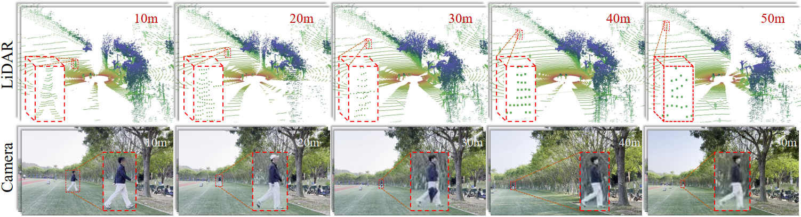
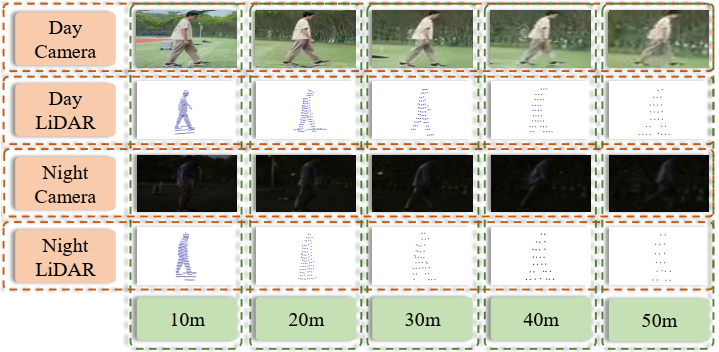
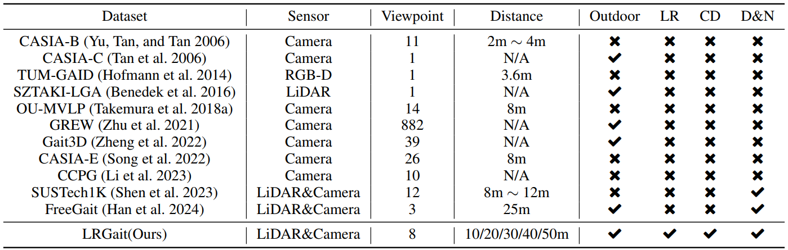
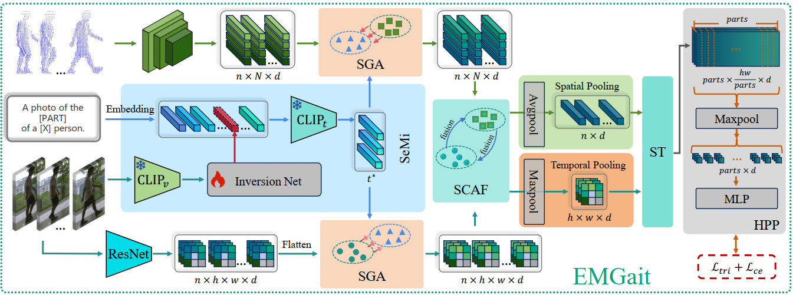

---

# Walking Further: Semantic-guided Multimodal Gait Recognition under Long-range Conditions

This repository provides the official implementation of the AAAI 2026 paper:

> **Walking Further: Semantic-guided Multimodal Gait Recognition under Long-range Conditions**
> *[Zhiyang Lu et al.]*
> Accepted at **AAAI 2026**

[[📄 Paper (AAAI 2026)]](link_to_paper) • [[📊 Dataset Request Form (PDF)]](link_to_pdf)

---

## 🧩 Overview

This work introduces **LRGait**, the first **LiDAR-Camera multimodal gait dataset** explicitly designed for **long-range and cross-distance** scenarios, and **EMGaitNet**, a **semantic-guided multimodal gait recognition framework**.

Our model directly consumes **raw RGB videos and point clouds** to learn discriminative, semantically aligned gait features, achieving **state-of-the-art performance** on LRGait, SUSTech1K, and FreeGait datasets.

📍 *Code and dataset will be released for research use upon publication.*

---

## 🌄 Dataset: LRGait

LRGait contains synchronized **LiDAR and RGB** gait sequences across **five distances (10m–50m)** and **eight viewpoints**, captured under diverse lighting (day/night) and weather conditions.

**Key statistics:**

* 101 subjects (79 males / 22 females)
* 5,280 gait sequences
* 209,000+ frames
* Multimodal data: RGB, point clouds, depth, and silhouettes
* Real-world outdoor collection with various props and attire


<p align="center">
  
  <br><em>Figure 1: Visualization of LRGait dataset across 10–50m.</em>
</p>
<p align="center">
  
  <br><em>Figure 2 (day vs. night visualization).</em>
</p>
<p align="center">
  
  <br><em>Figure 3 (data distribution).</em>
</p> 

---

## 🧠 Method: EMGaitNet

**EMGaitNet** is an end-to-end multimodal gait recognition model leveraging:

* **SeMi (Semantic Mining):** CLIP-based semantic cues extraction for body-part awareness.
* **SGA (Semantic-Guided Alignment):** Cross-modal alignment guided by semantic features.
* **SCAF (Symmetric Cross-Attention Fusion):** Hierarchical bidirectional 2D–3D feature fusion.
* **ST Module:** Spatio-temporal modeling of gait dynamics.


<p align="center">
  
  <br><em>Figure 4 (overall framework).</em>
</p>

---

## 🚀 Getting Started

### 1️⃣ Environment Setup

```bash
# Create conda environment
conda create -n emgait python=3.8
conda activate emgait

# Install PyTorch (version compatible with your CUDA)
# Example for CUDA 11.8:
pip install torch==2.1.2 torchvision==0.16.2 torchaudio==2.1.2 --extra-index-url https://download.pytorch.org/whl/cu118

# Install dependencies from OpenGait
pip install numpy tqdm tensorboard opencv-python pillow pyyaml matplotlib scikit-learn timm einops

```

### 2️⃣ Dataset Preparation

#### 🔹 Option A: Request via Form

To access **LRGait**, please fill out the **non-commercial usage request form**:

📄 [Download Request Form (PDF)](link_to_pdf)

After completing the form, send it to:
📧 `akawen@stu.xmu.edu.cn`

Upon approval, you will receive:

* Google Drive download link for LRGait
* SHA256 checksums and metadata file

#### 🔹 Option B: Direct Cloud Download (for approved users)

Once approved, download via:

```bash
wget https://drive.google.com/uc?id=<lrgait_id> -O LRGait.zip
unzip LRGait.zip
```

---

## 🧪 Training and Evaluation

```bash
# Train EMGaitNet on LRGait
python train.py --config configs/lrgait.yaml

# Evaluate on LRGait (cross-distance)
python eval.py --config configs/lrgait.yaml --mode cross_distance
```

🧭 **Trained Models**

| Dataset      | Modality    | Rank-1 (%) | Rank-5 (%) |
| ------------ | ----------- | ---------- | ---------- |
| LRGait       | RGB + LiDAR | **68.9**   | 85.8       |
| SUSTech1K    | RGB + LiDAR | **96.0**   | 99.0       |
| FreeGait     | RGB + LiDAR | **85.2**   | 96.8       |

---

## 📚 Citation

If you use LRGait or EMGaitNet in your research, please cite:

```bibtex
@inproceedings{yourname2026walkingfurther,
  title     = {Walking Further: Semantic-guided Multimodal Gait Recognition under Long-range Conditions},
  author    = {Your Name and Coauthors},
  booktitle = {Proceedings of the AAAI Conference on Artificial Intelligence (AAAI)},
  year      = {2026}
}
```

---

## 🙏 Acknowledgements

Our work is built upon and inspired by the following excellent projects and papers:

* **[OpenGait (Fan et al., TPAMI 2025)](https://github.com/ShiqiYu/OpenGait)** – unified gait recognition framework
* **[LidarGait (Shen et al., CVPR 2023)](https://github.com/ShiqiYu/OpenGait)** – LiDAR-based gait recognition benchmark
* **[FreeGait (Han et al., ACM MM 2024)](https://4dvlab.github.io/project_page/FreeGait.html)** – gait recognition in outdoor large-scale environments
* **CLIP (Radford et al., ICML 2021)** – for semantic alignment between modalities

---


---
## 📜 License

The dataset and code are released under a **Creative Commons Attribution-NonCommercial 4.0 License (CC BY-NC 4.0)**.
Use is restricted to **non-commercial research purposes only**.

---
